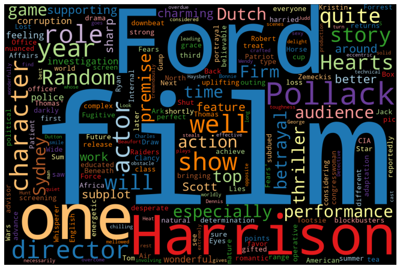

```{r child = "setup.Rmd"}
```

```{r packages, echo=FALSE, message=FALSE, warning=FALSE}
library(dplyr)
library(readr)
library(ggplot2)
library(emo)
```

## Executive Summary


.pull-left-wide[
**Q - 슬라이드의 템플리트 커스토마이징은 무엇인가요?**  
- **xaringan-themer.css**, **slides.css** 스타일시트를 수정하여, 
    - 나만의 슬라이드 템플리트를 만드는 것 
- **조직**과 **개인**의 **아이덴티티**를 반영한,
    - **개성있는** 슬라이드 템플리트를 생성
  

**Q - bitReport 슬라이드의 활용 방안은 무엇인가요?**  
- **데이터 분석 결과의 소개**
    - **프로젝트의 결과**를 **효과적**으로 **전달**
- **웹으로 배포**되는 프리젠테이션
    - **웹 브라우저만 있으면 사용 가능**
]


---

class: middle

# 이런 기능이 있어요

---

class: middle

# .hand[We...]

.huge[.green[have]] .hand[bitReport 패키지]

.huge[.pink[want]] .hand[우아한 머신러닝, 팬시한 결과, 감탄할 인사이트]

---

## 화면의 2개 컬럼으로 분할합니다 

.pull-left[
```{r echo=FALSE, out.width="50%"}

```
- **SNS에서 수집된 데이터**
- 개인정보보호 강화로 쪼그라드는 데이터
- 그래도 너가 있어서 다행이다.
]
.pull-right[
```{r echo=FALSE, out.width="50%"}

```
- 데이터 시각화, 그 이름은 **WordCloud**
- 빈도분석 중심의 개괄적인 이해
- 음, 그렇구나. 그래서 어쩌라구요?
]

---

## 표를 삽입합니다

.tip[
- R에서 생성한 **데이터 프레임을 표로 출력**<br>
- 집계표를 출력할 때 유용
]

<br>

.small[
```{r eval=TRUE, echo=FALSE}
library(dplyr)

method <- c(
  "문서 분류(Document Texonomy)", 
  "문서 분류(Document Classification)",   
  "주제 발견(Topic discovery)",
  "감정 분석(Sentiment analysis)", 
  "문서 요약(Document summarization)"
)
algorh <- c(
  "Patthern & Rule", 
  "Machine Laerning",
  "LDA topic analysis", 
  "감성사전, Machine Laerning",
  "Text Rank"
)
app <- c("상담 콜 분류", "상담 콜 민원 예측", "상담 콜 분류", 
         "긍부정 상담 콜 분석", "QA를 위한 상담콜 요약")


data.frame(method, algorh, app) %>% 
  rename("분석 주제" = method) %>% 
  rename("주된 분석 방법" = algorh) %>% 
  rename("활용 사례" = app) %>% 
  kableExtra::kbl(booktabs = TRUE) %>% 
  kableExtra::kable_styling()
```
]

---

## 데이터 시각화

.question[ 
페이스북 방문 회수의 하한과 상한은 어떻게 표현할까요?
]

```{r echo = FALSE, warning = FALSE}
load("data/student_survey.rda")

ggplot(student_survey, aes(x = fb_visits_per_day)) +
  geom_histogram(binwidth = 1) +
  labs(
    title = "하루에 페이스북을 몇 번이나 방문나요?", 
    x = "Number of times", y = NULL
    ) +
  theme_minimal(base_family = "NanumSquare")  
```

---

class: middle

# Q & A


